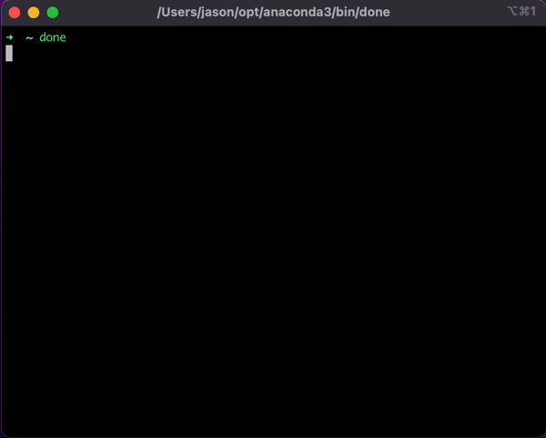
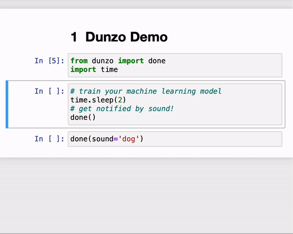

# Dunzo: sound alert for scripts  


| Terminal Demo      | Jupyter Notebook Demo |
| ----------- | ----------- |
| |        |


## What is it? 

[Dunzo](https://www.urbandictionary.com/define.php?term=dunzo) is "a slang word for done/finished". 
`dunzo` is a simple tool that plays sound. You can use a default sound that comes with the package or provide your own.
It is useful to be alerted when your machine learning model finishes training or when your pipeline finishes running. 

## Installation

```shell  
pip install dunzo
```

## Upgrade 

```shell 
pip install --upgrade dunzo
```

## Usage 

In Python 

```py 
from dunzo import done 
done()
# or 
done(sound="dog")
```

In Terminal:  

```sh 
done
# or 
done dog 
```

However, to make the above work you have to follow a few steps. If you know how to bypass this, please tell me.  

```shell
# find your python path  
which python # it would look like the following 
#$ /Users/<your_user_name>/opt/anaconda3/bin/python

# If so, your done command will live here: '/Users/<your_user_name>/opt/anaconda3/bin/done'
# You want to add it in your zshrc or bash_profile to setup an alias.  
open .zshrc # or equivalent 
# add the following line to .zshrc to create an alias   
alias done='/Users/<your_user_name>/opt/anaconda3/bin/done'
# restart terminal or source it 
source .zshrc
# run the command 
done # should output something like below:   
#$ Finished @ (Date) 2022-04-04 (Time) 06:18:59 PM PDT! Played flute sound
```

## Development 

```sh
# update your version 
poetry version <add_package_version> 
poetry publish --build
```

Adding development packages 

```shell
poetry add --dev <your package>
```

## List of available [sounds effect](https://mixkit.co/free-sound-effects/) 
 
- Uplifting flute notification: `flute` 
- Retro game notification: `game`
- Dog barking twice: `dog`  
