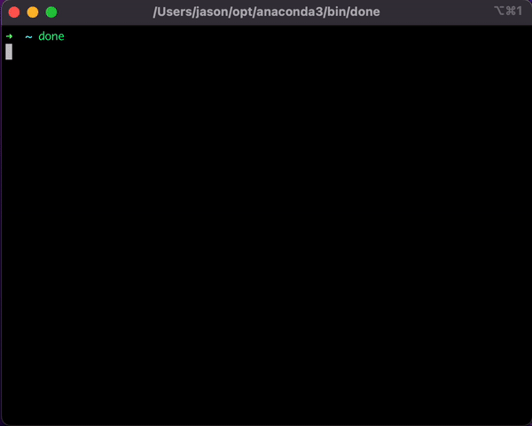
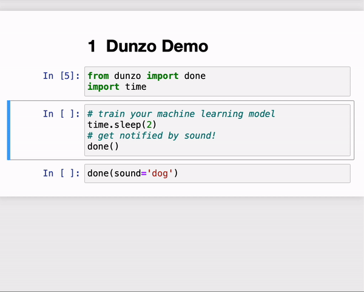

# Dunzo

* Tiny completion sounds for Python scripts and the command line.
* [Dunzo](https://www.urbandictionary.com/define.php?term=dunzo) is "a slang word for done/finished". 
* Dunzo is useful when a training job, notebook cell, shell command, or long-running script
finishes and you want a simple notifcation sound.

| Terminal Demo      | Jupyter Notebook Demo |
| ----------- | ----------- |
| |        |

## Install

```sh
pip install dunzo
```

For local development with UV:

```sh
uv sync
uv run pytest
uv run dunzo --list-sounds
```

## Use In Python

```py
# done or dunzo are identical, you can choose one. 
from dunzo import done, dunzo

done()
dunzo()
# for specific sounds 
done("success")
done("positive")
done("trumpet")
done("chime")
done("/path/to/your/sound.mp3")
```

## Use From The Command Line

```sh
# bare command
dunzo

# run specific sounds 
dunzo success
dunzo positive
dunzo trumpet
dunzo chime
dunzo /path/to/your/sound.mp3

# Built-in sounds:
dunzo --list-sounds
```

The package also installs a `done` console script, but `done` is a reserved word in
common shells like zsh and bash. Use `dunzo` as the normal terminal command, or run
the alias through another command:

```sh
uv run done
command done positive
\done trumpet
```

Dunzo uses local system audio players when available. If none are available, built-in sounds fall back to the terminal bell.The default sound is `success`.

## Sound Licensing

Dunzo bundles a few short notification sounds from Pixabay under the Pixabay Content License. Attribution is not required by Pixabay, but the source URLs and license notes are documented in `MAINTAINING.md`.

The `chime` sound is generated locally at runtime from simple waveforms and does not use a
bundled audio asset.

You can still pass a local audio file path if you want your own sound. Make sure you have the right to use that file in your environment or project.

## Development

```sh
uv sync
uv run ruff check .
uv run ruff format --check .
uv run pytest
uv build
```
